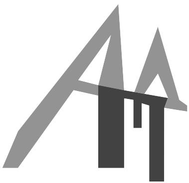

  

# EADUP
**Смысл важнее формы — автоматическая верстка документов по нормативным стандартам (СТО САФУ)**

Фокусируйтесь на содержании работы, не тратя время на борьбу с интерфейсом текстовых процессоров. Реализуя принцип «документ как код», система берет на себя создание идеально оформленного документа, что избавляет от рутинного форматирования и обеспечивает строгое соблюдение нормативных требований.

## Язык разметки / Markup Language
Документы создаются на `.ead` (Educational Activity Document) — облегченном языке разметки, разрабатываемом параллельно с нативным компилятором.

**Преимущества формата:**
* **Читаемость (Human-readable):** текстовый формат, который удобно читать и редактировать в любом текстовом редакторе без специального ПО.
* **Билингвальная оптимизация (Bilingual Layout):** синтаксис языка адаптирован для работы с русской раскладкой. Это минимизирует необходимость постоянного переключения между языками при написании текста и вводе команд разметки.

## Автор / Author
* **Разработчик:** Иван Гогленков (wellman4)
* **Год:** 2026

## Лицензия и Бренд / License & Trademark
* **Код:** исходный код проекта распространяется под лицензией **GNU AGPLv3**.
* **Бренд:** название **EADUP** и логотип являются интеллектуальной собственностью автора. При создании производных продуктов (форков) или коммерческих сервисов на базе данного кода обязательна смена названия и визуальной айдентики. Использование оригинального бренда для сторонних проектов без согласия автора запрещено.
